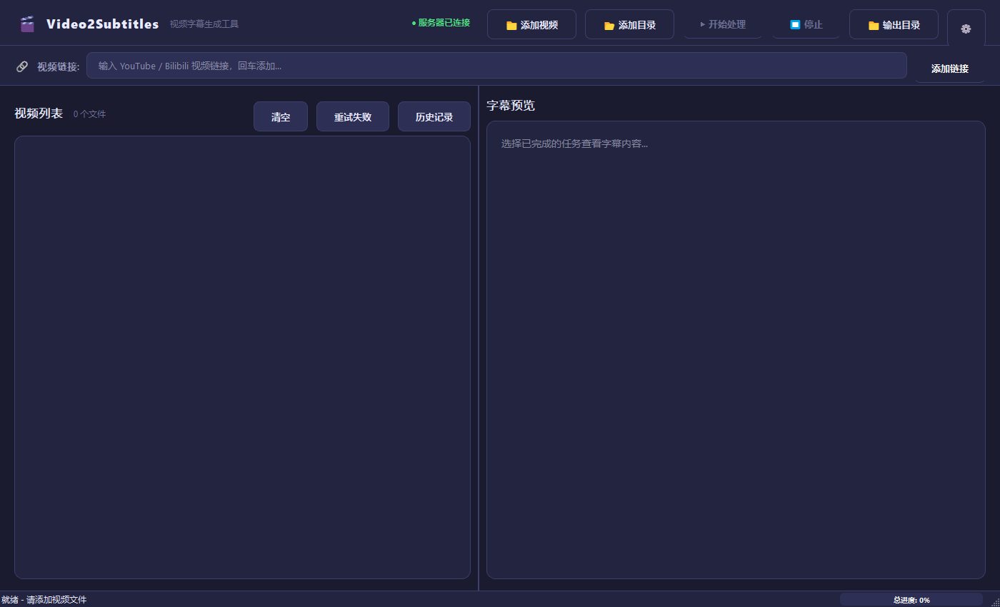
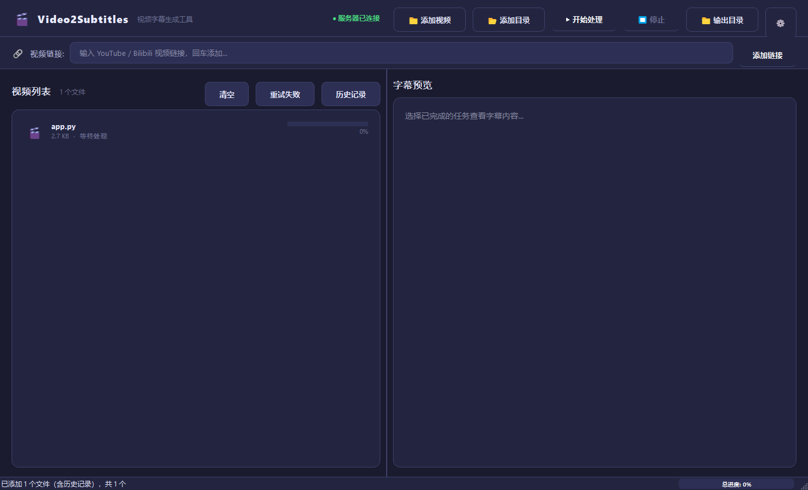
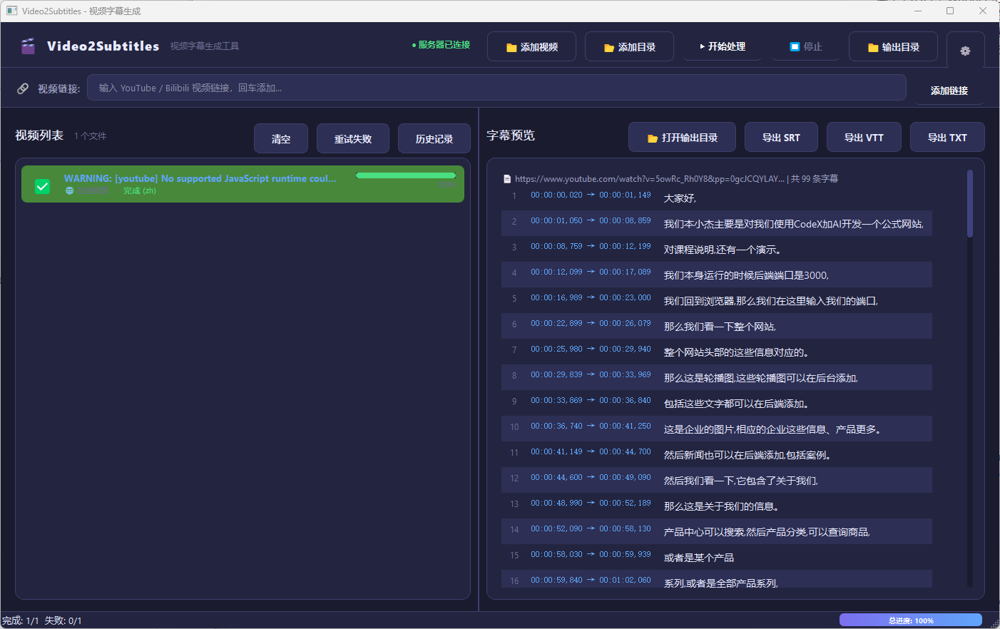

# 🎬 Video2Subtitles

视频字幕生成桌面工具 — 支持本地视频和在线视频链接，一键生成字幕并导出多种格式。

> A desktop GUI tool for generating subtitles from video files and online video links (YouTube, Bilibili, etc.). Built with PyQt5.

---

## 截图 / Screenshots

| 主界面 / Main Window | 字幕预览 / Subtitle Preview |
|---|---|
|  |  |
| **运行截图 / Processing** | |
|  | |

---

## 功能特色 / Features

- **本地文件 & 在线视频** — 支持 mp4/avi/mov/mkv 等常见格式，以及 YouTube、Bilibili 等平台链接
- **已内置 Whisper 服务** — 项目自带 `whisper-server/main.py`，启动客户端时会自动拉起本机 sidecar 服务
- **GPU 自动加速** — 默认自动检测 NVIDIA GPU；检测到 RTX/4070 等显卡时优先使用 `cuda + float16`，否则回退 `cpu + int8`
- **在线视频保留 MP4** — 在线链接默认优先下载并保存视频文件，字幕、原视频和 ChatGPT 分析包可以在同一输出目录中使用
- **下载策略可配置** — 支持「保存 MP4 视频」「仅转写不保留视频」「仅音频转写」三种模式，并可限制最高质量
- **YouTube 播放列表选择** — 粘贴带 `list=` 的 YouTube 链接时，可选择添加整个播放列表，或只添加当前粘贴的视频
- **自动多格式输出** — 任务完成后会自动保存 SRT、VTT、TXT，并生成 `manifest.json` 输出元数据
- **字幕工具模块化** — 字幕时间格式、SRT/VTT/TXT 读写、SRT 解析和文件名清洗集中到 `subtitle_utils.py`，降低重复实现
- **基础验证脚本** — 新增 `tools/check_project.py`，可执行源码语法检查和基础单元测试
- **安全源码打包** — 新增 `tools/package_source.py`，可生成便于发送给 AI 辅助排查的源码压缩包，默认排除模型、缓存、输出媒体、cookies、密钥和本地桥接目录
- **历史记录增强** — 历史窗口可打开输出目录、加回任务列表、重新生成 ChatGPT 包、复制/打开来源
- **错误日志增强** — 生成失败时会突出显示错误、弹出可复制详情，并在右侧预览区保留完整错误日志和服务日志尾部
- **标题获取增强** — 添加 YouTube 链接时会过滤 yt-dlp 的警告输出，避免把 `No supported JavaScript runtime...` 当成视频标题显示
- **一键环境检查** — 设置页可检查 Python、依赖、GPU、yt-dlp、ffmpeg、模型目录、输出目录、端口和服务健康状态
- **统一模型目录** — 客户端模型安装目录 `models/` 同时供内置服务和本地 fallback 使用，下载一次，两边共用
- **隐藏后台窗口** — Windows 下开始处理时，转写 helper、yt-dlp 等后台子进程不会再弹出空黑窗口
- **可见的服务状态** — 客户端底部会显示本地服务启动结果，启动日志写入 `.cache/whisper-service.log`
- **客户端模型安装** — 设置窗口可选择模型大小、模型目录，并一键安装/检查模型
- **本地优先流程** — 本地视频和在线链接都优先走内置本地服务；服务不可用时，本地视频会 fallback 到客户端直转
- **模型位置可配置** — 本地转录默认使用项目内 `models/` 作为模型目录，也支持指定自定义模型目录
- **本地 & API 转录** — 可直接使用 `faster-whisper` 本地转录，或连接自定义 Whisper Server
- **多格式导出** — 导出 SRT、VTT、TXT 字幕格式
- **ChatGPT 分析包** — 右侧字幕预览区和右键菜单都可生成含代理视频、关键帧和字幕的上传包；生成过程中会显示持续进度浮层，完成/失败后弹窗提醒，并支持打开包目录或复制路径/错误信息
- **字幕翻译** — 集成本地化引擎，支持 OpenAI 兼容 API 批量翻译字幕，术语表注入，断点续翻
- **翻译配置持久化** — 本地化设置中的 API 地址、模型和 Key 会保存到 `.cache/settings.json`，点击 OK 后同步刷新当前进程和本地化引擎运行时配置
- **双语+样式字幕** — 支持原文、译文、双语 ASS/SSA 字幕，可自定义字体、大小、轮廓、阴影和边距
- **硬字幕烧录** — 通过 FFmpeg 将字幕直接烧录到视频画面，支持质量预设（快速/平衡/高质量）
- **配音音色与试听** — 配音模式支持 Edge-TTS、本地 Qwen3-TTS 与火山引擎豆包 TTS，目标语言变化时自动刷新音色列表，并可生成试听音频
- **内置 Qwen3-TTS 默认配置** — 新安装或未创建 TTS Provider Preset 时，会自动提供「本地 Qwen3-TTS」配置，默认音色 Vivian、stable 一致性模式，便于直接启用本地配音
- **服务配置音色下拉** — TTS Provider Preset 编辑窗口的音色字段改为可编辑下拉框，选择 `qwen3-tts` 时会展示 Vivian、Serena 等内置音色，也支持手动输入自定义音色
- **当前音色优先** — 生成配音任务时，用户在本地化设置里当前选择的音色优先于 Provider Preset 的默认音色，避免选择 Serena/Dylan 后又被「本地 Qwen3-TTS」默认 Vivian 覆盖
- **退出自动停止后台服务** — 关闭主窗口时默认停止 Whisper、本地化引擎和 Qwen3-TTS sidecar，避免 Qwen3-TTS 模型继续占用显存；可用 `V2S_STOP_SIDECARS_ON_EXIT=false` 保留后台服务
- **火山引擎豆包 TTS** — 新增 `VolcengineDoubaoTTSProvider`，支持 X-Api-Key 与 AppId+AccessKey 两种认证方式，可配置资源 ID、模型、音频格式、采样率、语速、音量等参数
- **流水线阶段重试** — 本地化任务支持从任意阶段（翻译/字幕导出/TTS/音频混合/渲染）重新执行，避免全量重跑
- **单任务取消** — 右键菜单可单独停止正在进行的任务，不再只有全局停止
- **精确 TTS 音频裁剪** — 多段合并的 TTS chunk 使用 `atrim` 滤波器按时间窗口精确提取逐段音频，替代原字符比例估算
- **字幕时间轴保护** — stable/strict 配音分块会按字幕间隔、时间跨度和语速压力拆分，避免跨长静音合成后把后续语音提前切入；音频混合优先使用本轮 `audio/tts/index.json` 防止旧音频残留混入
- **TTS 时间规划器** — 新增 `localization-engine/tts/planner.py`，在合成前计算 gap、可借用空白、估算朗读时长、可用时长和 speed pressure，并写入 `tts_timeline_report.json` 方便排查吞音/提前/重叠
- **翻译完整性保护** — 配音模式下如果翻译缺失导致原文送入 TTS，流水线会以 `TRANSLATION_INCOMPLETE` 明确报错
- **音频混合可取消** — 所有 FFmpeg 子进程支持回调检测取消信号，混合/合成过程可快速终止
- **YouTube 字幕智能选择** — 支持 auto/youtube/whisper 三种字幕策略：auto 自动获取 YouTube 字幕、修复重分段、质量不达标回退本地 Whisper；youtube 强制字幕；whisper 强制本地识别
- **Fish.audio TTS** — 新增 Fish.audio TTS 提供者，支持 s2.1-pro-free / s2-pro / s1 模型，可配置 mp3/wav/opus 格式和采样率
- **自定义 TTS 设置** — 本地化对话框支持不绑定 Provider Preset 直接手动配置 TTS 参数
- **崩溃日志** — 未捕获异常自动写入 `.cache/crash.log`，便于排查无窗口崩溃问题
- **关闭窗口保护** — 任务运行中关闭窗口弹出确认提示，ChatGPT 打包运行中阻止关闭
- **用户视角主界面** — 主界面按「添加视频 → 开始处理 → 查看结果」重排为任务卡片，顶部只保留状态、输出目录、翻译/配音和设置入口，减少按钮拥挤
- **深色主题** — 现代化暗色 UI 界面

---

## 环境要求 / Prerequisites

- Python 3.10+
- PyQt5 `>=5.15`
- `requests`
- `faster-whisper`
- `fastapi` / `uvicorn` / `python-multipart` — 内置本地服务
- `yt-dlp` — 在线视频下载
- **可选依赖：**
  - `ffmpeg` — `yt-dlp` 合并在线视频音视频流，以及 ChatGPT 分析包的视频处理
  - NVIDIA 驱动 / CUDA 运行环境 — 使用 RTX 4070 等 NVIDIA GPU 推理时需要

---

## 安装 / Installation

```bash
pip install -r requirements.txt
```

如果你只处理本地视频，安装完成即可使用。如果要处理 YouTube/Bilibili 等在线链接，请确保 `yt-dlp` 和 `ffmpeg` 可用。打开设置后也可以点击「一键检查环境」查看当前依赖、GPU 和服务状态。

---

## 开发与验证 / Development Checks

轻量验证不会下载模型，也不会启动 Whisper 服务，适合每次改动后快速检查：

```bash
python tools/check_project.py
python -m unittest discover -s tests
```

`tools/check_project.py` 会执行项目 Python 源码语法编译和 `tests/` 基础单元测试。完整桌面端验证仍建议在 Windows 图形环境中手动启动 `python app.py` 或 `start_debug.bat` 检查。

生成给 AI 辅助排查的安全源码包：

```bash
python tools/package_source.py --dry-run
python tools/package_source.py --output video2subtitles-source-package.zip
```

`tools/package_source.py` 默认排除 `.git/`、`.cache/`、`models/`、`output/`、虚拟环境、cookies、`.env*`、密钥/证书、音视频文件、已有压缩包、下载模型和本地桥接目录。生成的 zip 内会附带 `PACKAGE_MANIFEST.json`，发送前建议快速查看一次跳过摘要。

---

## 维护记录 / Maintenance Notes

### 2026-07 — Fish.audio TTS、YouTube 字幕智能选择与翻译鲁棒性增强

- **Fish.audio TTS 支持**：新增 `FishAudioTTSProvider`（`localization-engine/tts/fish_audio_tts.py`），支持 Fish.audio API 的 `v1/tts` 端点，可配置 API Key、模型（`s2.1-pro-free` / `s2-pro` / `s1`）、音频格式（mp3/wav/opus）和采样率。设置页新增 Fish.audio 参数组，本地化对话框支持手动输入音色 ID 和试听。
- **YouTube 字幕智能选择**：新增「YouTube 字幕策略」三级控制（auto / youtube / whisper），auto 模式下自动获取 YouTube 字幕、修复断词并按语义重分段，质量不达标时自动回退本地 Whisper；youtube 模式强制使用 YouTube 字幕；whisper 模式跳过字幕直接本地识别。
- **YouTube 字幕重分段引擎**：`whisper-server/main.py` 新增 `_resegment_youtube_captions()`，将 YouTube 逐句显示字幕按停顿、句末标点、字符数上限和时长上限合并为适合翻译/TTS 的语义段落；新增 `_assess_youtube_caption_quality()` 多维度质量评分（片段碎片率、平均时长、平均字符数、时间轴重叠、重复字幕等），auto 模式下低于阈值自动回退 Whisper。
- **断词修复与数字碎片重连**：`subtitle_utils.py` 的 `reconstruct_split_words()` 扩展支持数字跨段落拆分修复（如 `"$17,"` / `"000."` → `"$17,000."`），避免孤立数字碎片导致翻译质量检测失败。
- **翻译响应解析增强**：`response_parser.py` 大幅重构，支持 JSON 字段别名（`translation`/`target_text`/`content` 等）、ID 字段别名、映射格式（`{"1": "..."}`），紧凑模式优先识别 `id<TAB>translation` TSV 格式，markdown 表格、编号列表、fenced JSON 均能正确解析，减少本地小模型输出格式漂移导致的翻译丢失。
- **翻译完整性保护优化**：新增 `TRANSLATION_INCOMPLETE` 检测，配音模式下翻译缺失或回退为源文本时写入 `translation_error_report.json` 并精确提示缺失 ID；翻译质量失败（如目标语言混入日语假名）的单个字幕不再中止整个配音流程，改为跳过 TTS 保留原音频。
- **翻译检查点 v2**：`CheckpointManager` 升级为 `translations.json` 格式，同时存储 `completed_ids` 和译文文本；重启后能恢复已翻译文本，旧的仅 ID 断点不再信任，避免重跑时静默跳过已丢失译文的字幕。
- **TTS 时序参数放宽**：`MAX_SPEED` 从 1.5 提升至 2.0、`max_tolerance_sec` 从 0.8 提升至 1.5、`max_speed_factor` 从 1.5 提升至 2.0，chunk 语速压力阈值同步上调，适配更多自然语速差异场景。新增「超时硬切」开关和溢出容忍秒数配置。
- **静音边界过滤**：chunk 切分时过滤音频首尾边缘静音，避免首尾静音被误当作分句边界导致首句/尾句时间窗口缩成静默片。
- **Qt 枚举规范化**：`AA_UseHighDpiPixmaps` / `AA_EnableHighDpiScaling` 改用 `Qt.AA_*` 标准枚举常量。
- **崩溃日志记录**：`app.py` 启动时启用 `faulthandler` 并注册线程/主线程异常钩子，未捕获异常写入 `.cache/crash.log`，便于排查无窗口崩溃问题。
- **关闭窗口安全保护**：`main_window.py` 新增 `closeEvent`，ChatGPT 打包运行中阻止关闭，其他任务运行中弹出确认提示，确认后自动停止 worker 并等待 5 秒。
- **自定义 TTS 设置**：本地化对话框 TTS 预设下拉新增「自定义 TTS 设置」选项，支持不绑定任何 Provider Preset 直接配置 TTS 参数；手动切换 TTS 服务商时自动切到自定义模式。
- **新文件**：`localization-engine/tts/fish_audio_tts.py`、`pack_for_chatgpt.bat`（ChatGPT 打包快捷脚本）。
- **测试覆盖**：新增/更新 `tests/test_translation_parser.py`（紧凑 TSV/JSON 字段别名/编号保护/markdown 表格/断点恢复）、`tests/test_translation_quality.py`（质量失败段跳过不中止）、`tests/test_subtitle_utils.py`（断词/数字碎片合并）、`tests/test_youtube_captions.py`（重分段/质量评估/策略别名）、`tests/test_qwen3_tts.py`（Fish.audio 请求验证）、`tests/test_client_settings.py`（字幕策略设置校验）、`tests/test_engine_api.py`（output_format/stream 传递）、`tests/test_localization_client.py`（interrupted 状态）、`tests/test_localization_language_codes.py`（自定义 TTS 不覆盖）、`tests/test_localization_dialog_tts.py`（新文件）。

### 2026-06 — 字幕样式微调、TTS 时序优化与音频混合改进

- **内置 Qwen3-TTS 默认配置**：Provider Presets 现在会在没有 TTS 配置时自动加入「本地 Qwen3-TTS」默认配置；若已有其它默认 TTS 配置，则仅补充 Qwen3-TTS 选项，不覆盖用户默认选择。
- **服务配置音色下拉修复**：`ProviderPresetEditDialog` 的 TTS 服务商改为可编辑下拉选择，音色字段改为可编辑下拉框；选择 `qwen3-tts` 时会直接列出 Vivian、Serena、Uncle_Fu 等内置音色，并保留自定义音色输入能力。
- **当前音色优先级修复**：运行配音任务时 `localization_runtime_config()` 会保留用户当前选择的 `tts_voice`，不再让 TTS Provider Preset 的默认 `voice` 覆盖当前选择，修复 Qwen3-TTS 一直使用 Vivian 的问题。
- **退出自动停止后台服务**：`app.py` 在 `QApplication.aboutToQuit` 和事件循环退出后统一调用 `shutdown_sidecars_on_exit()`，默认停止 Whisper、本地化引擎和 Qwen3-TTS sidecar，防止主窗口关闭后后台进程继续占用端口或显存；如需常驻服务可设置 `V2S_STOP_SIDECARS_ON_EXIT=false`。
- **安全源码打包脚本**：新增 `tools/package_source.py`，用于生成可发送给 AI 辅助排查的源码 zip；默认排除模型、缓存、输出目录、音视频、cookies、`.env*`、密钥证书、虚拟环境和本地桥接目录，并在压缩包内写入 `PACKAGE_MANIFEST.json` 便于复核；同时修复隐藏文件名前缀被错误去掉的问题。
- **TTS 字幕同步修复**：stable/strict 模式下 `build_tts_chunks` 会按字幕 gap、时间跨度和 planner 语速压力拆分 chunk，防止长间隔字幕或高压缩需求字幕被合成为连续语音；TTS 阶段新增 `tts_timeline_report.json`，音频混合阶段优先使用本轮 `index.json`，避免旧 `seg_*.wav` 残留造成错配。
- **TTS 时间规划器**：新增 `localization-engine/tts/planner.py`，在合成前为每条字幕计算 `gap_to_next`、`tolerance`、`available_duration`、`estimated_duration`、`speed_factor` 和 `speed_pressure`，并生成 chunk 级 `keep_gaps` / `split_reason` 诊断信息，借鉴 VideoLingo 的配音规划思路但保持原字幕时间轴不变。
- **Qwen3-TTS 音色选择修复**：选择 `qwen3-tts` 后会立即显示内置默认音色并保持下拉框可选，即使本地 Qwen3-TTS 服务未启动或 `/voices` 响应较慢，也不会卡在“加载中...”导致无法选择音色；后台刷新成功后会自动替换为服务返回音色。
- **字幕字号调整**：所有内置样式预设（default/netflix/youtube/bilingual/mobile_vertical）的 `font_size` 整体下调，以适配更多屏幕尺寸和嵌入场景；`margin_v` 微调，移动端竖屏样式边距从 80 调整为 60。
- **精确 TTS 时序控制**：速度约束范围收紧（MAX_SPEED 2.0→1.5，MAX_SLOW 0.75→0.8），`atempo` 失败时不再暴力裁剪音频，改为保留原始音频，避免音质劣化。目标时长计算引入 `nominal * 0.9` 下界，使 TTS 朗读节奏更自然。
- **沉默边界检测切分**：`timing.py` 新增 `detect_silence_boundaries()`，对合并 TTS chunk 使用 FFmpeg silencedetect 探测自然停顿点，实现逐段精确时间窗口划分；沉默检测不足时回退字符比例估算。
- **音频混合时长策略变更**：`mix.py` 中 `amix` 的 `duration` 参数从 `first` 改为 `longest`，当原音比 TTS 配音长时，混合结果以最长音频为准，避免原音被截断。
- **TTS 归一化去静音默认关闭**：`normalize.py` 中 `remove_silence` 默认从 `True` 改为 `False`，保留 TTS 自然首尾停顿，仅在需要时主动开启。
- **Qwen3-TTS max_new_tokens 自动估算**：根据文本中 CJK/非 CJK 字符比例动态计算安全 `max_new_tokens`，避免长文本被截断；合成后检测 chars/sec 比率，异常时记录截断警告日志。
- **视频 ID 提取修复**：修复 `main_window.py` 中 `_get_video_id` 对 URL 查询参数（如 `&t=...`）的处理，支持 `/?` 边界截断，并对提取结果做安全字符过滤；`output_patch.py` 使用 `glob.escape` 防止特殊字符匹配异常。
- **StyleRequest 模型扩展**：本地化引擎 API 的 `StyleRequest` 新增 `alignment` 和 `bold` 字段，与 `job_models.py` 的 `SubtitleStyle` 对齐。

### 2026-06 — Qwen3-TTS 音色一致性修复

- **TTS Voice Profile 冻结**：新增 `TtsVoiceProfile` 统一配置对象（`localization-engine/tts/voice_profile.py`），每个任务开始时将所有 TTS 参数（voice、model、seed、temperature、top_p、参考音频等）冻结为一个 profile，所有调用共用该 profile，杜绝逐句独立生成时参数漂移。
- **字幕段合并（Chunking）**：新增 `buildTtsChunks`（`localization-engine/tts/chunking.py`），在 stable/strict 模式下自动将短字幕合并为较长 chunk（默认 500 字符 / 45 秒），大幅减少 TTS 独立调用次数，从源头解决音色不一致。
- **三种一致性模式**：新增「音色一致性模式」下拉选择器，支持 `fast`（逐句生成，固定参数，速度优先）、`stable`（合并 chunk 生成，默认推荐）、`strict`（合并生成 + 详细日志 + 失败重试）。
- **音频后处理统一**：新增 `normalize_tts_audio`（`localization-engine/audio/normalize.py`），所有 TTS 输出在合并前统一采样率（24kHz）、声道（mono）、响度（loudnorm）并去除首尾静音。
- **错误码**：新增 `TTS_VOICE_PROFILE_MISMATCH`、`TTS_PROMPT_AUDIO_INVALID`、`TTS_TIMBRE_INCONSISTENT`、`TTS_CHUNK_GENERATION_FAILED`、`TTS_AUDIO_NORMALIZE_FAILED`。
- **日志增强**：日志和 `tts_control_report.json` 中记录 voice_profile_hash、consistency_mode 等字段，支持事后排查音色不一致问题。
- **测试**：新增 `tests/test_tts_voice_profile.py`，覆盖 profile hash 一致性、chunk 合并逻辑、空文本处理。

### 2026-06 — 用户视角主界面重排

- **顶部导航减负**：主窗口顶部从密集操作按钮改为品牌标题、服务状态、输出目录、翻译/配音和设置入口，降低首次打开时的信息噪音。
- **任务卡片流程**：左侧操作区改为「① 添加视频」「② 开始处理」「③ 任务列表」三段式布局，把本地文件、目录、在线视频链接和开始按钮集中到用户实际操作路径中。
- **运行期防误操作**：任务运行时会同步禁用本地添加按钮、链接添加按钮和链接输入框，任务完成或启动失败后恢复，避免处理中误添加造成状态混乱。
- **文案统一**：任务计数和状态提示统一使用「视频」和「开始生成字幕」表达，降低"文件/任务/处理"混用带来的理解成本。

### 2026-06 — 本地化、翻译 API 与 Qwen3-TTS 增强

- **TTS 音色选择与试听**：本地化设置的配音模式新增音色下拉、刷新和试听按钮；Edge-TTS 会按目标语言过滤音色，Qwen3-TTS 会优先读取本地 sidecar `/voices`，服务未启动时回退到预设音色。
- **Qwen3-TTS sidecar**：新增 `qwen3-tts-engine/` 和 `ui/qwen_tts_setup_dialog.py`，支持本地 Qwen3-TTS 服务状态检测、模型加载、语音合成能力探测，以及与本地化引擎的 TTS provider 对接。
- **Qwen3-TTS 服务生命周期修复**：此前 Qwen3-TTS sidecar 仅能通过手动对话框启动且 auto-start 函数从未被调用（死代码），导致 TTS 阶段服务未运行时报笼统 `No TTS audio was generated`。本次修复包括：
  - `localization-engine/engine/pipeline.py`：TTS 合成前增加 `/health` 预检，服务不可用时立即以 `TTS_SERVICE_DOWN` 终止任务并给出明确操作指引（"请在设置→Qwen3-TTS 管理中启动服务"），替代逐段失败后笼统的 `TTS_NO_OUTPUT`。
  - `main_window.py`：发起配音任务前探测 Qwen3-TTS 健康状态，不可用时尝试自动启动；仍失败时弹框阻止任务发出。
  - `app.py main()`：当保存设置 `tts_provider == qwen3‑tts` 且 `localization_mode == dub` 时，后台 daemon 线程自动 `ensure_qwen3_tts_engine()`（仅起 HTTP 进程，不预加载模型，首请求按 `qwen_mode` 自动按需加载）。
  - `tests/test_localization_engine.py`：新增 `test_qwen3_tts_fails_with_service_down` 回归测试，mock `/health` 返回连接拒绝，断言 pipeline 以 `TTS_SERVICE_DOWN` 失败；同时为既有稳定 seed 测试补上健康检查 mock。
- **翻译设置保存修复**：`LocalizationDialog` 点击 OK 后会保存 `translation_base_url`、`translation_model`、`translation_api_key`，并调用 `apply_settings_to_env(..., overwrite=True)` 覆盖旧 `V2S_TRANSLATION_*` 运行时变量，避免旧环境变量反向覆盖新设置。
- **翻译 Key 热更新**：本地化引擎新增 `/config/translation-api-key`，新任务也会把当前 Key 传给引擎但不会写入任务记录，避免重启前后继续使用旧 Key。
- **OpenAI 兼容响应增强**：翻译客户端兼容 NewAPI 风格的 `data.choices` 响应；401/403/404/400 会保留服务端 JSON 错误详情，不可恢复错误不再重复重试，日志会继续脱敏 API Key。
- **YouTube cookies 与下载错误提示**：Whisper 服务会检查 `whisper-server/cookies.txt` 是否包含真实 YouTube/Google cookies，并在登录、过期、格式不可用时给出更明确的中文提示。
- **FFmpeg 配音合成修复**：配音合成统一使用 `localization_workspace/rendered/` 输出目录，自动创建父目录，并在 FFmpeg 失败时返回 stderr 尾部，便于复制错误日志定位问题。
- **验证覆盖**：新增/更新 `tests/test_qwen3_tts.py`、`tests/test_translation_parser.py`、`tests/test_localization_language_codes.py`、`tests/test_youtube_captions.py` 和 `tests/test_localization_engine.py`，覆盖音色、翻译响应解析、YouTube cookies 和音频合成错误路径。

### 2026-06 — Phase 3：字幕翻译与烧录 MVP

- **本地化引擎 sidecar**：在 `localization-engine/` 中新增独立的 FastAPI 服务（端口 8766），提供 `/health`、`/jobs`、`/cancel`、`/retry`、`/logs` 端点，由 `app.py` 自动启动。
- **Pipeline 编排**：新增 `PipelineRunner`，按 `prepare → normalize → translate → subtitle_export → render → finalize` 顺序执行，支持 checkpoint 断点续跑。
- **字幕标准化**：`localization-engine/subtitles/normalize.py` 支持读取 SRT/ASS/VTT 并转为 `SubtitleSegment`；`subtitle_ass.py` 支持生成带样式的 ASS 字幕（原文/译文/双语）。
- **翻译引擎**：`localization-engine/translation/` 提供 OpenAI 兼容 API 翻译提供者、分段批处理、术语表注入（JSON/CSV）、响应解析和 API Key 脱敏日志。
- **FFmpeg 渲染**：`services/ffmpeg_service.py` 支持硬字幕烧录（atomic rename 防止损坏文件）和软字幕封装；`localization-engine/rendering/` 提供字幕滤镜构造和编码预设（快速/平衡/高质量）。
- **客户端集成**：新增「🌐 本地化」工具栏按钮，打开 `LocalizationDialog` 设置翻译参数；ASR 完成后自动将源字幕提交到本地化引擎，翻译完成后的字幕自动显示在预览区。
- **详情配置**：`localization_dialog.py` 支持模式选择（快速字幕/翻译字幕成片）、源语言/目标语言、翻译服务（OpenAI 兼容）、API 地址/模型/Key、字幕模式（双语/仅译文/仅原文）、硬字幕烧录和软字幕封装。
- **新增文件**：`localization_client.py`、`localization-engine/`、`services/ffmpeg_service.py`、`services/sidecar_manager.py`、`ui/localization_dialog.py`、`ui/subtitle_style_dialog.py`、`subtitle_ass.py`。

### 2026-06 — 火山引擎豆包 TTS 与流水线阶段重试

- **火山引擎豆包 TTS**：新增 `VolcengineDoubaoTTSProvider`（`localization-engine/tts/volcengine_tts.py`），支持 X-Api-Key 与 AppId+AccessKey 两种认证方式。UI 设置页新增「火山引擎豆包 TTS」参数组，涵盖端点、模型、格式、采样率、语速、音量等配置项。
- **流水线阶段重试**：本地化任务支持从指定阶段（翻译/字幕导出/TTS/音频混合/渲染）重新执行，避免全量重跑。已完成阶段自动跳过，已翻译字幕文件自动复用。
- **单任务取消**：右键菜单支持单独停止正在进行的本地化任务，`api_client.py` 新增 `cancel_task()`，本地转录支持 `LocalWhisperTranscriber.cancel()`。
- **精确 TTS 音频裁剪**：`localization-engine/tts/timing.py` 新增 `extract_audio_window()`，使用 `atrim` 滤波器按时间窗口精确提取逐段音频，替代字符比例估算。
- **翻译完整性保护**：配音模式下若翻译缺失导致原文送入 TTS，流水线以 `TRANSLATION_INCOMPLETE` 明确报错，避免产生错误音频。
- **音频混合可取消**：`localization-engine/audio/mix.py` 中所有 FFmpeg 子进程支持回调检测取消信号，混合/合成可快速终止。
- **翻译后端增强**：兼容 NewAPI 风格的 `data.choices` 响应，非可恢复错误不再重复重试，日志继续脱敏 API Key。
- **新环境变量**：`VOLCENGINE_TTS_ENDPOINT`、`VOLCENGINE_TTS_API_KEY`、`VOLCENGINE_TTS_APP_ID`、`VOLCENGINE_TTS_ACCESS_KEY`、`VOLCENGINE_TTS_RESOURCE_ID`、`VOLCENGINE_TTS_MODEL`、`VOLCENGINE_TTS_FORMAT`、`VOLCENGINE_TTS_SAMPLE_RATE`、`VOLCENGINE_TTS_SPEECH_RATE`、`VOLCENGINE_TTS_LOUDNESS_RATE`。
- **测试新增**：新增/更新 `tests/test_ass_writer.py`、`tests/test_localization_engine.py`、`tests/test_localization_language_codes.py`、`tests/test_qwen3_tts.py`、`tests/test_translation_parser.py`、`tests/test_youtube_captions.py`，覆盖 ASS 写入、阶段重试、翻译解析和音色一致性。

### 2026-06 — 任务状态模型与取消/重试优化

- **新增任务状态模型**：在 `core/task_state.py` 中定义 `TaskStatus` 枚举（PENDING、QUEUED、DOWNLOADING、PROCESSING、SAVING、COMPLETED、ERROR、CANCELLED）和 `TaskInfo` 数据类，提供 `status_to_ui_text()` 和 `normalize_status()` 安全转换函数，兼容现有字符串状态。
- **停止按钮行为改进**：点击停止后，WorkerThread 立即设置 `_cancel_event`，`wait_for_result()` 循环中检测到取消标记后立即返回 `{"status": "cancelled"}`，不再无休止等待服务结果。UI 中被取消的任务显示「已取消」，进度保持当前值。已完成任务不受影响。停止后所有按钮状态正确恢复。
- **失败任务重试整理**：「重试失败」按钮只处理 `error` 状态任务，不处理 `cancelled` 任务。右键菜单对 `cancelled` 任务提供「重新处理」选项。重试前清理旧错误信息。已完成任务不会被重试。
- **`api_client.py` 兼容性**：`wait_for_result()` 新增可选参数 `cancel_checker=None`，旧调用方式完全兼容。

---

## 使用 / Usage

### 推荐首次流程 / First-run Workflow

1. 启动客户端：`python app.py` 或双击 `start.bat`。
2. 如果右上角显示「⚠ 需要安装模型」，点击「⚙」打开设置。
3. 点击「一键检查环境」，确认依赖、GPU、端口、模型目录和输出目录状态。
4. 在「Whisper 模型」里选择模型大小，通常先用 `base`、`small` 或速度更快的 `large-v3-turbo`。
5. 在「GPU / 推理设备」里保持默认「自动」，有 NVIDIA GPU 时会优先使用 CUDA。
6. 按需要设置「在线视频下载模式」和「下载质量」，默认「保存 MP4 视频（推荐）」。
7. 点击「安装/检查模型」，等待状态显示「模型已就绪」。
8. 在主界面「① 添加视频」中添加本地视频、目录或在线视频链接，然后点击「▶ 开始生成字幕」。

> 现在项目已经内置 `whisper-server/`。客户端安装的模型会通过 `WHISPER_MODEL_DIR` 传给内置服务，因此在线链接和本地文件可以共用同一份模型缓存。

### 启动 / Launch

```bash
python app.py
```

Windows 下也可双击：

- `start.bat` — 生产模式启动，会自动尝试拉起 `whisper-server/main.py`，后台窗口默认隐藏
- `start_debug.bat` — 调试模式启动（显示控制台），方便查看本地服务日志

### GPU / RTX 4070 加速

默认设置为：

```text
推理设备: auto
计算类型: auto
```

自动模式会按下面规则解析：

| 检测结果 | 实际使用 |
|---|---|
| 检测到 NVIDIA GPU，例如 RTX 4070 | `cuda + float16` |
| 未检测到 NVIDIA GPU | `cpu + int8` |

确认是否用上 4070：

1. 打开「⚙ 设置」。
2. 查看「GPU / 推理设备」区域，应该显示类似：`自动模式将使用 cuda/float16`。
3. 点击「一键检查环境」，查看「GPU 推理」一项。
4. 处理视频时也可以打开任务管理器或运行 `nvidia-smi` 观察显存和 GPU 占用。

如果之前已经启动过旧版内置服务，它可能仍然以 CPU 模式常驻。修改 GPU 设置后，请关闭客户端并结束旧的 Python/Whisper 服务进程，或者直接重启电脑后再启动客户端，确保新的 `DEVICE=cuda` / `COMPUTE_TYPE=float16` 生效。

如果自动模式没有识别 4070，请检查：

- NVIDIA 驱动是否正常安装
- 命令行运行 `nvidia-smi` 是否能看到 4070
- faster-whisper / CTranslate2 是否具备 CUDA 支持
- 设置页是否被手动改成了 `CPU`

### Whisper 服务与模型目录 / Whisper Service and Model Paths

项目现在自带轻量本地服务：

- `whisper-server/main.py`：内置 FastAPI sidecar，提供 `/health`、`/transcribe`、`/upload`、`/status/{task_id}`。
- `models/`：默认的 `faster-whisper` 模型缓存/存放目录。客户端本地 fallback 和内置服务都会使用这里。

内置本地服务默认监听：

```text
http://127.0.0.1:8765
```

桌面端自动拉起本地服务时会把 `WHISPER_MODEL_DIR`、`WHISPER_MODEL_PATH`、`MODEL_SIZE`、`DEVICE`、`COMPUTE_TYPE`、`V2S_DOWNLOAD_MODE`、`V2S_DOWNLOAD_QUALITY` 传入服务进程。也就是说，在设置窗口里下载/选择的模型、GPU 设备和下载策略，对在线链接和本地文件都有效。

在线链接处理时，内置服务会优先使用 `yt-dlp` 下载视频并合并为 MP4；桌面端随后会把下载得到的视频、字幕、历史记录和 `manifest.json` 保存到同一个输出子目录。右键已完成任务，或在右侧字幕预览区点击「📦 生成 ChatGPT 包」，都可以生成 ChatGPT 分析包；分析包会使用该视频生成 480p 代理视频、关键帧和上传 zip。

生成 ChatGPT 包时，主窗口会弹出持续显示的进度浮层，展示当前阶段和百分比，例如压缩代理视频、抽取关键帧、写入清单、生成轻量/完整上传包。生成完成后会弹出提醒，可直接打开包目录或复制路径；生成失败时可一键复制错误信息。

### 输出目录内容 / Output Folder

每个任务完成后会生成独立输出子目录，通常包含：

```text
视频文件.mp4
字幕.srt
字幕.vtt
字幕.txt
manifest.json
chatgpt_package/      # 生成 ChatGPT 包后出现
```

`manifest.json` 会记录来源链接/路径、标题、语言、字幕数量、视频文件、SRT/VTT/TXT 文件、下载模式、下载质量和 ChatGPT 包路径。即使历史记录文件损坏，输出目录本身也保留了任务元数据。

### 历史记录 / History

点击「历史记录」可以查看已处理任务。历史窗口支持：

- 打开输出目录
- 加回任务列表
- 重新生成 ChatGPT 包
- 复制来源路径/链接
- 打开来源文件夹或浏览器链接

### 在线标题获取 / Online Title Fetching

添加在线视频链接后，客户端会异步调用 `yt-dlp` 预取标题。标题预取只用于列表展示，不影响后续下载、转写和输出保存。

为避免 YouTube 近期的 JavaScript runtime / 签名警告污染标题显示，标题预取现在会：

- 分离 `yt-dlp` 的 stdout 和 stderr，只从 stdout 读取标题。
- 使用 `--no-warnings` 并过滤 `WARNING:`、`ERROR:`、`No supported JavaScript runtime...` 等非标题行。
- 复用设置中的代理 `V2S_PROXY`，并自动使用 `whisper-server/cookies.txt`。
- 如果标题仍然获取失败，则保留原始链接显示，不再把报错文本当标题。

### YouTube 播放列表 / YouTube Playlists

粘贴带 `list=` 参数的 YouTube 链接时，客户端会先弹出选择：

- **添加整个列表**：使用 `yt-dlp` 读取播放列表条目，并把列表内视频逐个添加为普通单视频任务。
- **只添加当前视频**：自动移除 `list`、`index`、`pp` 等播放列表参数，只保留当前粘贴视频本身。

播放列表展开只发生在添加链接阶段；后续下载、转写、历史记录、输出目录和 ChatGPT 分析包仍复用单视频任务流程。

### 错误日志 / Error Logs

生成过程中如果任务失败，客户端会：

- 在任务列表中使用更醒目的红色错误状态显示失败原因。
- 弹出「错误日志」窗口，包含任务来源、完整错误信息、`.cache/whisper-service.log` 路径和最近 80 行服务日志，可一键复制。
- 选中失败任务时，右侧预览区会显示完整错误日志，并提供「复制错误日志」按钮。
- 重新处理失败任务时，会清理该任务的旧错误日志，避免误复制旧内容。

### 在线视频下载策略 / Online Download Strategy

设置窗口支持三种下载模式：

| 模式 | 说明 | 适合场景 |
|---|---|---|
| 保存 MP4 视频（推荐） | 下载并保留 MP4，输出目录中会有原视频，ChatGPT 完整包可用 | 默认模式，推荐大多数用户使用 |
| 仅用于转写，不保留视频 | 下载视频用于识别，完成后清理下载的视频文件 | 只需要字幕、想节省磁盘空间 |
| 仅音频转写（节省空间） | 使用 yt-dlp 提取音频进行转写 | 只要字幕，不需要视频文件；完整视频分析包可能不可用 |

下载质量可选择：最高可用质量、最高 720p、最高 480p。

### 模型与路径配置 / Model and Path Settings

1. 点击右上角「⚙」打开设置。
2. 在「Whisper 模型」里选择「模型大小」，支持 `tiny`、`base`、`small`、`medium`、`large-v2`、`large-v3`、`large-v3-turbo`。
3. 设置「模型缓存目录」，用于保存或读取 `faster-whisper` 模型文件。
4. 如需使用某个已经转换好的模型，设置「具体模型目录」；留空时按「模型大小」从缓存目录加载或下载。
5. 在「GPU / 推理设备」中选择 `自动`、`CUDA` 或 `CPU`，并选择计算类型。
6. 点击「安装/检查模型」提前下载或验证模型。
7. 点击「一键检查环境」可检查依赖、GPU、服务、端口和目录权限。

设置会保存到 `.cache/settings.json`，下次启动自动生效。外部环境变量仍可覆盖客户端保存的值。

也可以通过环境变量覆盖默认路径：

| 变量 | 说明 |
|---|---|
| `WHISPER_SERVER_DIR` | 可选。自定义 Whisper 服务目录；未设置时默认使用项目内 `whisper-server/` |
| `WHISPER_SERVER_URL` | 可选。自定义服务地址；默认 `http://127.0.0.1:8765` |
| `API_AUTH_KEY` | 可选。远程或手动启动服务的 API Key；客户端会作为 `x-api-key` 发送 |
| `WHISPER_MODEL_DIR` | 可选。自定义模型缓存/存放目录；未设置时默认使用项目内 `models/` |
| `WHISPER_MODEL_PATH` | 可选。指定某个已转换好的 `faster-whisper` / CTranslate2 模型目录；设置后优先于 `MODEL_SIZE` |
| `MODEL_SIZE` | 可选。模型名称，如 `tiny`、`base`、`small`、`medium`、`large-v3`、`large-v3-turbo`；默认 `base` |
| `DEVICE` | 可选。推理设备：`auto`、`cuda`、`cpu`；默认 `auto` |
| `COMPUTE_TYPE` | 可选。计算类型：`auto`、`float16`、`int8_float16`、`int8`、`float32`；默认 `auto` |
| `V2S_DOWNLOAD_MODE` | 可选。在线视频下载模式：`video`、`transcribe_only`、`audio`；默认 `video` |
| `V2S_DOWNLOAD_QUALITY` | 可选。下载质量：`best`、`720p`、`480p`；默认 `best` |
| `V2S_KEEP_DOWNLOADED_VIDEO` | 可选。是否保留下载视频：`true` / `false`；默认 `true` |
| `V2S_PROXY` | 可选。在线视频标题预取和 yt-dlp 下载使用的代理地址；留空表示直连 |
| `V2S_YOUTUBE_CAPTION_POLICY` | 可选。YouTube 字幕策略：`auto`（自动选择）、`youtube`（强制字幕）、`whisper`（强制本地识别）；默认 `auto` |
| `V2S_YOUTUBE_CAPTION_RESEGMENT` | 可选。是否对 YouTube 字幕进行智能重分段：`true` / `false`；默认 `true` |
| `V2S_STOP_SIDECARS_ON_EXIT` | 可选。关闭主窗口时是否停止 Whisper、本地化引擎和 Qwen3-TTS 后台服务：`true` / `false`；默认 `true` |
| `VOLCENGINE_TTS_ENDPOINT` | 可选。火山引擎豆包 TTS API 地址；默认 `https://openspeech.bytedance.com/api/v3/tts/unidirectional` |
| `VOLCENGINE_TTS_API_KEY` | 可选。X-Api-Key 认证密钥（新控制台推荐） |
| `VOLCENGINE_TTS_APP_ID` | 可选。AppId 认证（旧控制台） |
| `VOLCENGINE_TTS_ACCESS_KEY` | 可选。AccessKey 认证密钥（旧控制台） |
| `VOLCENGINE_TTS_RESOURCE_ID` | 可选。资源 ID；默认 `seed-tts-2.0` |
| `VOLCENGINE_TTS_MODEL` | 可选。模型名称；默认 `seed-tts-2.0-expressive` |
| `VOLCENGINE_TTS_FORMAT` | 可选。音频格式；默认 `mp3`，可选 `wav`/`pcm`/`ogg_opus` |
| `VOLCENGINE_TTS_SAMPLE_RATE` | 可选。采样率；默认 `24000` |
| `VOLCENGINE_TTS_SPEECH_RATE` | 可选。语速调节；默认 `0`，范围 -100~100 |
| `VOLCENGINE_TTS_LOUDNESS_RATE` | 可选。音量调节；默认 `0`，范围 -100~100 |
| `FISH_TTS_API_BASE` | 可选。Fish.audio API 地址；默认 `https://api.fish.audio` |
| `FISH_TTS_API_KEY` | 可选。Fish.audio API Key |
| `FISH_TTS_VOICE` | 可选。音色 ID |
| `FISH_TTS_MODEL` | 可选。模型名称；默认 `s2.1-pro-free` |
| `FISH_TTS_FORMAT` | 可选。音频格式；默认 `mp3`，可选 `wav`/`opus` |
| `FISH_TTS_SAMPLE_RATE` | 可选。采样率；默认 `44100` |

Windows 示例：

```bat
set WHISPER_MODEL_DIR=D:\AI\whisper-models
set MODEL_SIZE=small
python app.py
```

强制使用 4070 / CUDA：

```bat
set DEVICE=cuda
set COMPUTE_TYPE=float16
python app.py
```

指定单个本地模型目录：

```bat
set WHISPER_MODEL_PATH=D:\AI\whisper-models\models--Systran--faster-whisper-small\snapshots\xxxx
python app.py
```

连接已有远程服务：

```bat
set WHISPER_SERVER_URL=http://192.168.1.10:8765
set API_AUTH_KEY=your-secret-key
python app.py
```

### 本地服务启动状态排查 / Local Service Troubleshooting

`start.bat` 和 `app.py` 都会尝试启动本地 Whisper 服务。为了避免打扰用户，生产模式下服务窗口默认隐藏；点击「开始处理」时启动的转写 helper、`yt-dlp` 等后台子进程也会隐藏控制台窗口。如果启动失败，客户端底部状态栏会显示原因。

常见状态：

- `本地+在线就绪`：本地模型可用，在线链接服务也已连接。
- `在线服务已连接`：`127.0.0.1:8765` 可用，但本地 `faster-whisper` 未检测到。
- `本地模式就绪`：本地视频可转录，在线视频链接会自动尝试启动内置服务。
- `需要安装模型/服务`：既没有可用服务，也没有可用本地模型。

启动日志位置：

```text
.cache/whisper-service.log
.cache/localization-service.log
.cache/qwen3-tts-service.log
```

默认关闭主窗口时会停止这些后台服务。如果你想在重启桌面端时保留服务和已加载的 Qwen3-TTS 模型，可在启动前设置：

```bat
set V2S_STOP_SIDECARS_ON_EXIT=false
python app.py
```

如果客户端没有显示在线服务已连接，请优先检查：

1. 是否已经运行 `pip install -r requirements.txt`。
2. 端口 `8765` 是否被其他程序占用。
3. `yt-dlp` 和 `ffmpeg` 是否可用，尤其是在线链接下载失败时。
4. 设置页点击「一键检查环境」。
5. 打开 `.cache/whisper-service.log` 查看 Python 报错。
6. YouTube 标题或下载异常时，优先更新 `yt-dlp`，必要时安装 Node.js/Deno 等 JavaScript runtime 或使用 cookies。

需要直接看到服务窗口时，请使用 `start_debug.bat`。

### 基本流程 / Workflow

1. **添加视频** — 点击「添加视频」选择本地文件，或粘贴在线视频链接；若 YouTube 链接包含播放列表，可选择添加整个列表或只添加当前视频
2. **开始处理** — 点击「开始处理」下载/保存视频并进行字幕转录
3. **预览字幕** — 点击已完成的任务查看字幕内容
4. **翻译字幕（可选）** — 点击「🌐 本地化」打开翻译设置，选择目标语言和翻译服务（OpenAI 兼容 API），点击确定后再次处理时会自动翻译字幕并将翻译烧录到视频
   - 配音模式可选择 `edge-tts`、`qwen3-tts` 或 `volcengine-doubao`，选择目标语言后会刷新可用音色，点击「试听」可快速验证当前音色。
   - OpenAI 兼容 API 地址请使用真实接口根路径，例如 `https://example.com/v1`；`/chat/completions` 会由程序自动拼接。
5. **失败排查** — 如果任务失败，选中失败任务查看完整错误日志，或点击「复制错误日志」发给开发者定位
6. **导出/打包** — 右键导出 SRT/VTT/TXT，或在右侧字幕预览区点击「生成 ChatGPT 包」；打包期间会显示进度浮层，完成后可打开包目录或复制路径
7. **历史管理** — 点击「历史记录」重新打开输出、加回任务列表或重新生成 ChatGPT 包

---

## 常见问题修复 / Troubleshooting

### 中文标题乱码 / Chinese Title Garbled

如果 YouTube/Bilibili 视频的中文标题显示为乱码（如 `???????? S1 Ep4??...`），是由于 Windows 系统编码（CP936/GBK）无法正确输出 Unicode 字符。

**修复**：已在以下位置设置 `PYTHONIOENCODING=utf-8` 环境变量：
- `title_fetch_patch.py` — 标题预取时 QProcess 子进程
- `whisper-server/main.py` — yt-dlp 下载子进程

### yt-dlp 未找到 / yt-dlp Not Found

如果提示 `未找到 yt-dlp`，但已通过 pip 安装，说明 `yt-dlp.exe` 不在系统 PATH 中。

**自动降级**：代码已内置自动降级逻辑，依次尝试：
1. `yt-dlp` 命令（PATH 中查找）
2. 用户 Python Scripts 目录下的 `yt-dlp.exe`
3. `python -m yt_dlp`（模块方式运行）

### 翻译 API 认证或模型不可用 / Translation API Auth or Model Errors

本地化引擎使用 OpenAI 兼容的 `/chat/completions` 接口。若翻译失败，请优先检查：

1. API 地址应指向真实接口根路径，例如 `https://example.com/v1`，不要填写文档站地址或网页控制台地址。
2. 点击本地化设置 OK 后，API 地址、模型和 Key 会保存并热更新到本地化引擎；如果引擎进程很旧，重启应用可强制加载最新代码。
3. `401/403` 通常表示 Key 无效、过期、额度不足或分组权限不匹配。
4. `404 当前 API 不支持所选模型` 表示 Key 可以访问服务，但该网关的 chat 通道不支持当前模型；即使 `/models` 能列出模型，也不代表 `/chat/completions` 一定可调用。
5. `5xx` 或空响应通常是上游通道暂时不可用，建议在网关后台切换可用渠道或更换模型后重试。

### YouTube 需要登录 / YouTube Login Required

如果 YouTube 下载提示需要登录，请在浏览器中登录 YouTube 后导出 Netscape 格式 cookies，并放到：

```text
whisper-server/cookies.txt
```

`whisper-server/cookie_backups/` 和 cookies 文件不会提交到仓库。替换 cookies 后重新处理任务即可。

### TTS 配音失败 / TTS Dubbing Failed

如果生成任务提示 `TTS_EMPTY_INPUT`、`TTS_NO_AUDIO_OUTPUT`、`TTS_ZERO_BYTE_AUDIO` 或 `TTS_GENERATION_FAILED`，表示转写/翻译已经完成，但 TTS 阶段没有生成有效音频。

常见原因：

1. **TTS_EMPTY_INPUT**：字幕或翻译文本全为空，TTS 没有可朗读的内容。
2. **TTS_NO_AUDIO_OUTPUT**：TTS 执行完成但输出目录无任何音频文件，可能是 TTS 模型未正确安装或引擎异常。
3. **TTS_ZERO_BYTE_AUDIO**：TTS 生成了文件但全部为 0 字节，通常是引擎写文件失败或磁盘空间/权限问题。
4. **TTS_GENERATION_FAILED**：引擎调用异常（如 Qwen3-TTS 服务未运行、voice 配置不存在）。
5. **TTS 参数配置**：确保已选择有效的 voice、目标语言与 voice 匹配。

排查命令：

```powershell
Select-String -Path "D:\software\video_2_subtitles\.cache\whisper-service.log" -Pattern "tts|TTS|Traceback|Exception|Error|audio|wav|mp3|voice|cuda|ffmpeg"
```

> 如果字幕已生成但 TTS 失败，程序会保留字幕结果，用户可以先导出字幕。

### pythonw 未找到 / pythonw Not Found

启动脚本 `start.bat` / `start_debug.bat` 现在会自动查找可用的 Python 解释器：
`pythonw` → `python` → `py`，找不到时给出明确提示。

---

## 项目结构 / Project Structure

```
video_2_subtitles/
├── app.py              # 入口文件 / Entry point
├── main_window.py      # 主窗口界面 / Main GUI window
├── api_client.py       # Whisper API 客户端 / API client
├── local_whisper.py    # 本地 Whisper 转录 / Local transcriber
├── gpu_config.py       # GPU 自动检测和设备解析 / GPU config helpers
├── gpu_patch.py        # GPU 设置界面补丁 / GPU settings patch
├── whisper_config.py   # Whisper 路径和模型配置 / Whisper path config
├── client_settings.py  # 客户端持久化设置 / Client settings
├── diagnostics.py      # 环境检查 / Runtime diagnostics
├── output_manifest.py  # 输出元数据 / Output metadata
├── subtitle_utils.py   # 字幕格式化、解析和文件名清洗 / Subtitle utilities
├── output_patch.py     # 输出流程和历史记录增强 / Output workflow patch
├── error_log_patch.py  # 错误日志展示和复制增强 / Error log UI patch
├── title_fetch_patch.py # 在线标题获取增强 / Online title fetch patch
├── playlist_patch.py   # YouTube 播放列表添加模式选择 / Playlist add-mode patch
├── settings_patch.py   # 设置窗口和启动流程扩展 / Setup flow extension
├── history.py          # 历史记录管理 / History manager
├── requirements.txt    # Python 依赖 / Dependencies
├── whisper-server/     # 内置 Whisper 服务 / Bundled local service
│   ├── main.py         # FastAPI sidecar / Local API server
│   ├── requirements.txt
│   ├── cache/          # 服务端字幕缓存 / Service cache
│   └── temp/           # 下载和上传临时文件 / Temporary files
├── localization-engine/ # 本地化引擎 / Localization engine sidecar
│   ├── main.py         # FastAPI sidecar (port 8766)
│   ├── engine/         # Pipeline 编排 / Pipeline orchestrator
│   ├── subtitles/      # 字幕读写、标准化、验证 / Subtitle I/O & validation
│   ├── translation/    # 翻译提供者、批处理、术语表 / Translation providers
│   ├── tts/            # TTS 提供者、时间规划和分块 / TTS providers, planning and chunking
│   │   ├── planner.py   # TTS 时间规划器 / TTS timeline planner
│   │   ├── fish_audio_tts.py # Fish.audio TTS / Fish.audio TTS provider
│   │   └── volcengine_tts.py # 火山引擎豆包 TTS / Volcengine Doubao TTS
│   ├── audio/          # 音频混合、标准化 / Audio mixing & normalization
│   └── rendering/      # FFmpeg 滤镜和编码预设 / FFmpeg filters & presets
├── qwen3-tts-engine/   # 本地 Qwen3-TTS sidecar / Local Qwen3-TTS sidecar
│   ├── main.py         # FastAPI sidecar (port 8767)
│   └── engine/         # 模型管理、音色、合成 / Model manager & synthesis
├── localization_client.py # 本地化引擎 HTTP 客户端 / Localization API client
├── services/
│   ├── ffmpeg_service.py  # FFmpeg 渲染（烧录/软字幕）/ Rendering service
│   └── sidecar_manager.py  # Sidecar 进程管理 / Sidecar process manager
├── ui/
│   ├── localization_dialog.py   # 本地化设置对话框 / Localization settings dialog
│   ├── qwen_tts_setup_dialog.py # Qwen3-TTS 管理对话框 / Qwen3-TTS setup dialog
│   └── subtitle_style_dialog.py # 字幕样式编辑器 / Subtitle style editor
├── models/             # 默认模型目录 / Default model directory
├── .cache/             # 本地设置、服务日志和辅助脚本缓存 / Local cache
├── start.bat           # 生产启动（Win） / Production launcher
├── start_debug.bat     # 调试启动（Win） / Debug launcher
├── tools/              # 开发验证与安全源码打包脚本 / Development check and source package scripts
├── tests/              # 基础单元测试 / Unit tests
├── example.png         # 界面截图 / Screenshot
├── example2.png        # 界面截图 / Screenshot
├── example3.png        # 运行截图 / Processing screenshot
└── output/             # 字幕输出目录 / Output directory
```

---

## 服务配置方案

“服务配置方案（Provider Presets）”用于把翻译 API 和 TTS 配音 API 的常用参数保存为可复用配置。用户可以为不同服务商、模型、音色或项目场景建立多套配置，在生成任务时直接选择，并把常用配置设为默认。

### 新增翻译配置

1. 打开“本地化设置”或“设置 → 服务配置”。
2. 在“翻译服务”页点击“新增”。
3. 填写配置名称、服务商、API 地址、模型、API Key、源语言、目标语言、超时和并发等参数。
4. 点击 OK 保存。API Key 只写入本机 `.cache/provider-presets.json`，不会提交到仓库。

### 新增 TTS 配置

1. 打开“本地化设置”或“设置 → 服务配置”。
2. 在“TTS 配音服务”页点击“新增”。
3. 填写配置名称、服务商、API 地址、模型、音色、格式、采样率、并发、句间隔和时长对齐等参数。
4. Qwen3-TTS、Edge-TTS、Windows SAPI、火山引擎豆包 TTS 可以分别保存为不同配置。

如果本机还没有任何 TTS 配置，系统会自动提供「本地 Qwen3-TTS」默认配置：服务商为 `qwen3-tts`，默认音色 `Vivian`，一致性模式 `stable`。如果用户已经有其它默认 TTS 配置，系统只会补充 Qwen3-TTS 选项，不会抢占用户原来的默认配置。编辑 TTS 配置时，服务商和音色都是可编辑下拉框；选择 `qwen3-tts` 后音色下拉会列出 Vivian、Serena、Uncle_Fu、Dylan、Eric、Ryan、Aiden、Ono_Anna、Sohee，同时仍允许输入自定义 speaker 名称。生成任务时，本地化设置中当前选择的音色优先级高于 Provider Preset 的默认音色，因此可以临时从 Vivian 切到 Serena/Dylan 而不必修改预设本身。

### 设置默认配置

在服务配置管理窗口选中一条配置，点击“设为默认”。每种类型（翻译 / TTS）只会保留一个默认配置；禁用配置不会作为默认配置使用。

### 生成任务时切换配置

在“本地化设置”中使用“翻译配置”和“TTS 配置”下拉框选择本次任务要使用的方案。任务历史只记录当时使用的配置 ID 和配置名称，不保存完整 config，也不会保存 API Key。

### API Key 与配置文件安全

服务配置保存在 `.cache/provider-presets.json`，旧版本地化设置仍保存在 `.cache/settings.json`。`.cache/` 已加入 `.gitignore`，默认不会进入版本库。导出配置时会自动清空 `apiKey` 等敏感字段，便于分享结构和非敏感参数。

### 旧配置兼容

如果本机已有旧的翻译或 TTS 设置，应用首次读取服务配置时会自动迁移为默认 Provider Preset，同时保留旧字段，避免破坏已有字幕生成、翻译和配音流程。

### 后续计划

- 增强真实测试连接能力
- TTS 试听与连接测试联动
- 任务模板
- 多服务失败自动切换
- 音频防重叠
- 音色一致性锁定

---

## 许可 / License

MIT
